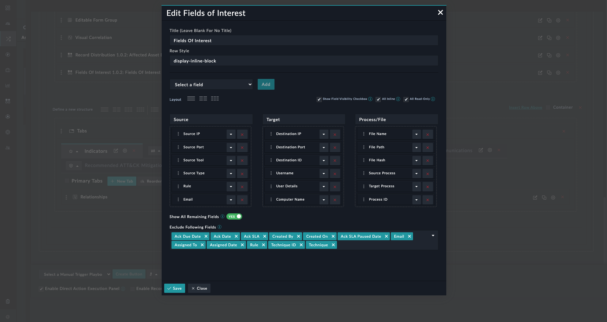

| [Home](../README.md) |
|--------------------------------------------|

# Installation
1. To install a widget, click **Content Hub** > **Discover**.
2. From the list of widget that appears, search for and select **Fields of Interest**.
3. Click the card of the **Fields of Interest** widget.
4. Click **Install** on the bottom to begin installation.

# Configuration

## Fields of Interest Widget Settings

| Fields                    | Description                              |
| ------------------------- | ---------------------------------------- |
| Title                     | Specify the heading or title of the visual depiction for the group of fields displayed in this widget. |
| Select a field Dropdown   | Select the fields that you want to include in this widget to be displayed on the the detailed view of the module records. |
| Layout                    | Select the layout of the widget, i.e., choose between a single column (default), 2-column structure, or a 3-column structure. |
| Show Field Visibility Checkbox         | To show the 'Hide Empty Fields' Checkbox in detailed view of the module. |
| All Inline                | Select this option to make all fields within the widget as inline fields, i.e., fields that can be edited using click-to-edit. If this option is cleared, then all fields display an edit button for editing purposes. |
| All Read-Only             | Select this option to make all fields within the widget as read-only, irrespective of assigned permissions. |
| Column Title              | (Optional) Specify a suitable column title for the group of selected fields. |
| Show All Remaining Fields | A toggle button that when enabled, adds an additional column named 'Others' that contains all the remaining fields of the module.   If you enable **Show All Remaining Fields**, then from the **Exclude Following Fields** drop-down, you can select fields that you do not want to display in the 'Others' column, i.e., these fields will not be displayed in this widget on the detail view of the module record. |
