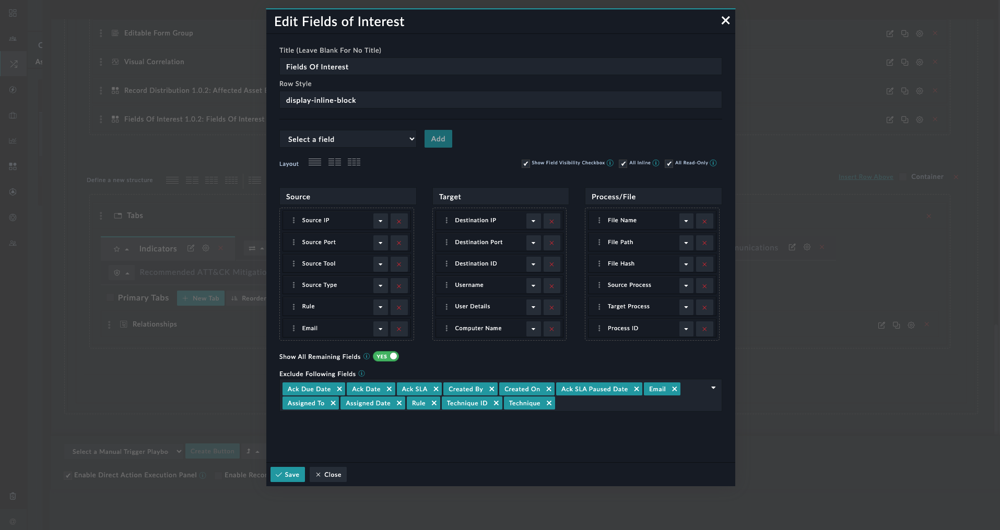
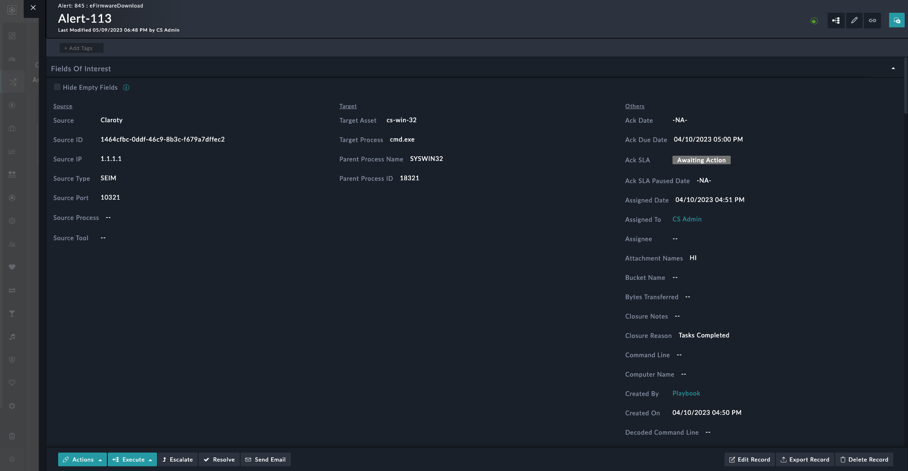
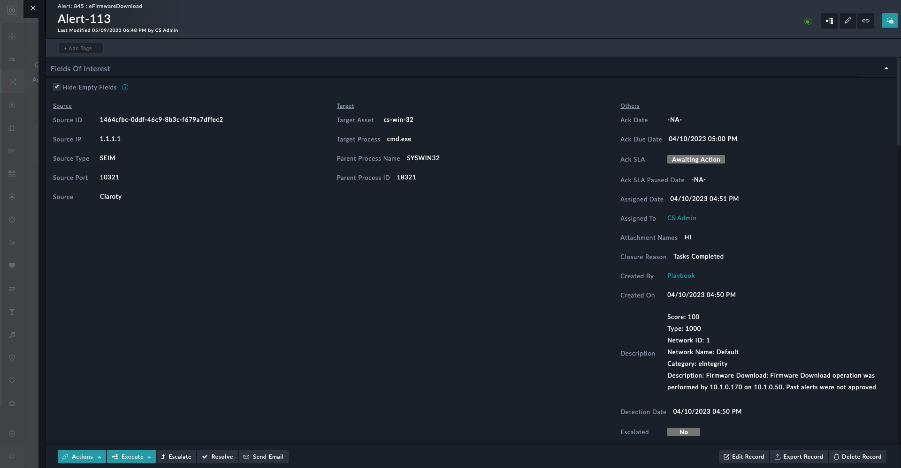

| [Home](../README.md) |
|--------------------------------------------|

# Usage

**Fields of Interest Widget Edit View**

1. Select layout.
2. Add fields to the perticular column, to change the column, drag and drop the field to the respective column.
3. Toggle the "Show all remaining fields" to create a new column "Others" with all the remaining fields.
4. Select fields to exclude from the others column.

**Widget**

A checkbox is provided at the detailed view to hide empty fields at run time.

Detailed view

Detailed view with hide empty fields checkbox ticked

