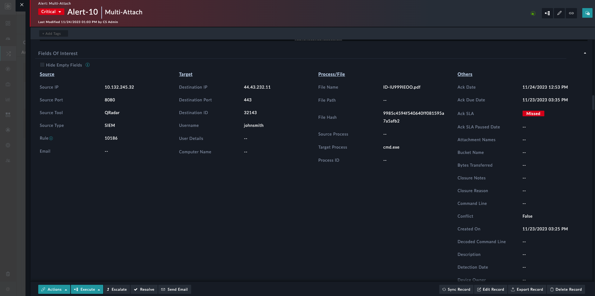

| [Home](../README.md) |
|--------------------------------------------|

# Usage

**Fields of Interest Widget Edit View**

1. Add fields of interest.
2. Select column layout.
3. Specify column title, eg. 'Source' and 'Target'.
4. To change the column, drag and drop a field to the respective column.
5. Toggle the "Show all remaining fields" to create a new column "Others" with all the remaining fields.
6. Select fields to exclude from the others column.

**Widget**

A checkbox is provided at the detailed view to hide empty fields at run time.

Detailed view.

Detailed view with hide empty fields checkbox ticked.

