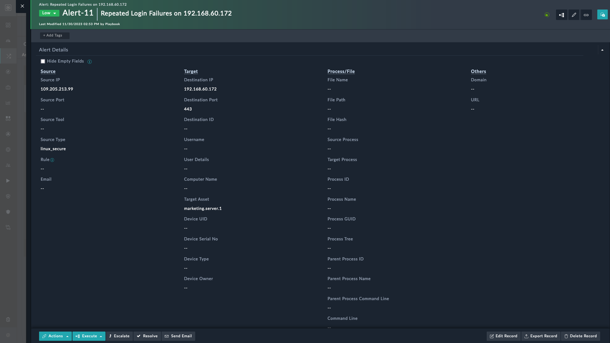

| [Home](../README.md) |
|----------------------|

# Usage

The Fields Of Interest widget displays selected fields in the detailed view of a module with the following additional features:

- Display fields in the detail view of a module record regardless of any visibility constraints

   >For example, a visibility condition on the *Source Port* field of the **Alert** module may display it only if the *Alert Type* is set *Brute Force Attempt*. This widget can still display the *Source Port* field for all alert types.

- Ability to hide or show record fields that are empty.

You can configure this widget separately for each module, i.e., the modification of this widget done for one module is independent of other modules.

## Fields of Interest Widget Views

To add this widget to the detail view of a module record, perform the following steps:

1. Click to open the detailed view of a record, for example an alert.

    

2. Click **Edit Template** () to display its System View Template (SVT).

    

3. Click **Add Widget** and select the **Fields Of Interest** widget from the **Widget Library** section.

    

4. Specify the title of the widget in the **Title (Leave Blank For No Title)** field.

    

5. Specify the display style in the **Row Style** field. For now, you can either leave it blank or enter **display-inline-block**. Following screenshots display the widget with different styling.

    |  |  |
    |:-------------------------------------:|:----------------------------------------:|
    |   Row Style `display-inline-block`    |           No Row Style applied           |

6. Select fields to be added to this widget and click the **Add** button.

    

7. Select a column layout under **Layout**. You can select from following options:

    - Single-column structure
    - 2-column structure
    - 3-column structure

    

    To arrange fields, drag-and-drop them to respective columns.

8. Select the checkbox **Show Field Visibility Checkbox** to display the *Hide Empty Fields* checkbox in detailed view of the module.

    

9. Select the checkbox **All Inline** to make the fields editable.

    

10. Select the checkbox **All Read-Only** to display the fields as read-only.

    

11. Enable the **Show all Remaining Fields** toggle to include all remaining fields of the module and create a new column called *Others* in the detail view of the record.

    

12. Select fields that you want to exclude from the *Others* column from the **Exclude Following Fields** drop-down.

    

13. Click **Save** to save the changes made to the widget

14. Click **Apply Changes** to add the widget to the detail view of the module's record.

### Fields of Interest Widget View Panel Views

The following image displays the detailed view of an alert record when the **Hide Empty Fields** checkbox is selected.

The following image displays the detailed view of an alert record when the **Hide Empty Fields** checkbox is cleared.

| [Installation](./setup.md#installation) | [Configuration](./setup.md#configuration) |
|-----------------------------------------|-------------------------------------------|