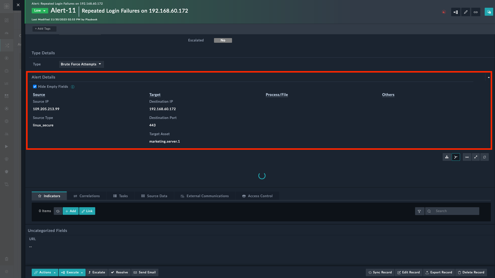

| [Home](../README.md) |
|--------------------------------------------|

# Usage

The Fields Of Interest widget to display selected fields in the detail view of an individual module with the following additional features:

- Ability to display fields in the detail view of a module record regardless of any visibility constraint that might have been set.  
  For example, you might have defined a visibility condition on the 'Source Port' field of the 'Alert' module to be visible only of if the Alert Type is set as 'Brute Force Attempt'. Now, you can use this widget to display the 'Source Port' fields of all types of alerts.
- Agility to hide or show record fields that are empty.

You can configure this widget separately for each module, i.e., the modification of this widget done for one module is independent of other modules.

## Fields of Interest Widget Views
### Fields of Interest Widget Edit View
To add this widget to the detail view of a module record, do the following:
1. Open the detail view of a record, for example an alert record and click **Edit Template** to display its SVT (System View Template).
2. Click **Add Widget** and select the **Fields Of Interest** widget, which displays the `Edit Fields of Interest` dialog, using which you can edit the widget as per your requirement.   
     
   The fields used for editing the widgets are explained in the [Setup](./setup.md#fields-of-interest-widget-settings) section. In brief you can setup the widget as follows:
    1. Specify widget tile and also select the fields to be added to this widget for display in the detailed view of the module record.
    2. Select column layout, for example, the 2-column structure, and specify the column titles, for example, 'Source' and 'Target'.  
       To arrange fields, drag and drop them to a respective columns.  
       You can also set the display elements such as Hide Empty Values, All Inline, etc., within widgets to control the behavior and display of fields within this widget.
    3. To include all remaining fields of the module, enable the "Show all Remaining Fields" toggle.  
    4. This creates a new column called *Others* in the detail view of the record that contains remaining fields of the module.  
     Once **Show all Remaining Fields** is enabled, then from the **Exclude Following Fields** drop-down, you can select fields that you want to exclude from the *Others* column.
3. Click **Save** to save the modifications done to the widget and click Apply Changes to add the widget to the detail view of the module records. 

### Fields of Interest Widget View Panel Views

If you have setup the widget to hide empty fields from detailed view by selecting the **Hide Empty Fields** checkbox, then the detail view of your module record, an Alert record in our example appears as follows:  

However, if you have cleared the **Hide Empty Fields** checkbox, then the detail view of your module record will contain all the fields, and the Alert record appears as follows:  

